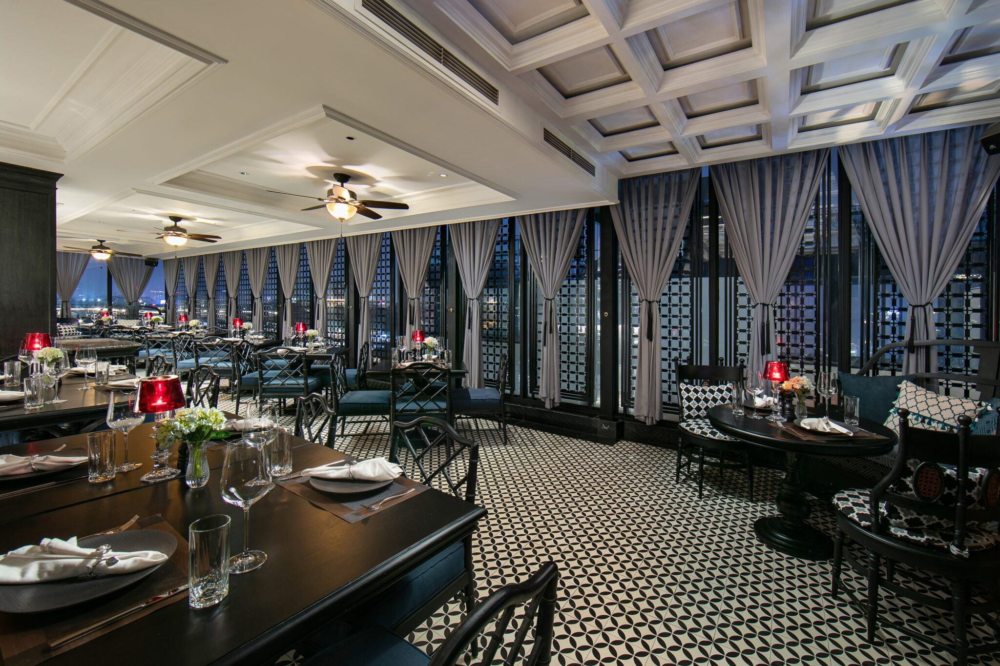

# 🏨 HỆ THỐNG QUẢN LÝ VÀ ĐẶT PHÒNG KHÁCH SẠN TRỰC TUYẾN

## 📌 Giới thiệu

Đề tài **“Xây dựng hệ thống quản lý và đặt phòng khách sạn trực tuyến”** là khóa luận tốt nghiệp ngành Công nghệ phần mềm tại Học viện Nông nghiệp Việt Nam.

Hệ thống được xây dựng dựa trên khảo sát thực tế tại **La Sinfonia del Rey Hotel and Spa**, nhằm số hóa quy trình quản lý và đặt phòng, giảm phụ thuộc vào phương thức thủ công và các nền tảng trung gian (OTA).

---

## 🎯 Mục tiêu đề tài

- Xây dựng website đặt phòng khách sạn trực tuyến chuyên nghiệp.
- Tự động hóa quy trình quản lý phòng và đặt phòng.
- Giảm sai sót và trùng lịch đặt phòng.
- Tăng khả năng tiếp cận khách hàng trực tiếp.
- Nâng cao hiệu quả vận hành và tối ưu doanh thu.

---

## 🛠 Công nghệ sử dụng

### Frontend
- ReactJS
- Tailwind CSS

### Backend
- Node.js
- ExpressJS

### Database
- MongoDB
